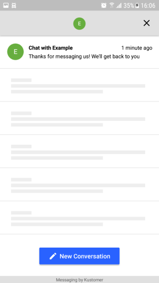
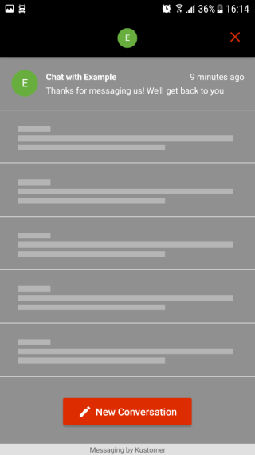
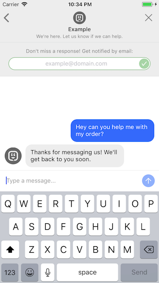
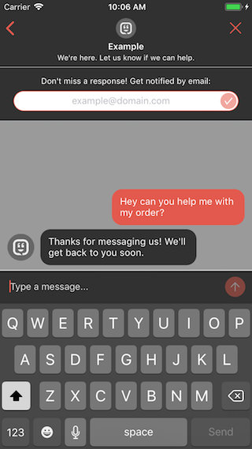

<p align="center" >
  
</p>

----------------

<p align="center" >
  The Android SDK for the <a href="https://www.kustomer.com/">Kustomer.com</a> mobile client
</p>

## Requirements

- A [Kustomer.com](https://www.kustomer.com/) API Key
- Android Min SDK Version 21 i.e.., Android 5.0 Lollipop

#### API Key

The Kustomer Android SDK requires a valid API Key with role `org.tracking`. See [Getting Started - Create an API Key](https://dev.kustomer.com/v1/getting-started)


## Installation

#### Gradle

Include the library in your `app.gradle`:

```ruby
//TODO: Not uploaded yet
```

## Setup

1. In your project's Application Class:
```java
import com.kustomer.kustomersdk.Kustomer;

private static final String K_KUSTOMER_API_KEY = "YOUR_API_KEY";

@Override
public void onCreate() {
    super.onCreate();
    Kustomer.init(this, K_KUSTOMER_API_KEY);
}
```

2. When you want to present the Kustomer chat interface to your users:

```java
Intent intent = new Intent(activity, KUSSessionsActivity.class);
activity.startActivity(intent);

// OR

Kustomer.showSupport(activity);
```

##### Add permissions to manifest:

3. Internet Permissions (Required):
```xml
<uses-permission android:name="android.permission.INTERNET" />
<uses-permission android:name="android.permission.ACCESS_NETWORK_STATE" />
```

4. Multimedia Permissions (Optional):
```xml
<uses-permission android:name="android.permission.CAMERA"/>
<uses-permission android:name="android.permission.READ_EXTERNAL_STORAGE"/>
```

Note: If neither of the Multimedia Permissions is declared, the image attachments button will be hidden.

##### Declaring Activities

5. Add `KUSSessionsActivity` & `KUSChatActivity` into your `AndroidManifest.xml`
```xml
<activity android:name="com.kustomer.kustomersdk.Activities.KUSSessionsActivity"
            android:configChanges="orientation|screenSize|keyboardHidden"
            android:theme="@style/KUSAppTheme" />

<activity android:name="com.kustomer.kustomersdk.Activities.KUSChatActivity"
            android:configChanges="orientation|screenSize|keyboardHidden"
            android:theme="@style/KUSAppTheme" />
```

### Additional API Reference

```java
// Initialize the Kustomer android SDK with an API key, and start a user session.
Kustomer.init(this, "API_KEY");
```

```java
// Convenience method that will present the chat interface.
Kustomer.showSupport(ACTIVITY);

// Convenience methods that will present a browser interface pointing to your KnowledgeBase.
Kustomer.presentKnowledgeBase(ACTIVITY);
```

```java
// Resets the user session, clearing the user's access to any existing chats from the device.
Kustomer.resetTracking();
```

```java
// Securely identify a customer. Requires a valid JSON Web Token.
Kustomer.identify("SECURE_ID_HASH");

/*
 Identifying users is the best way to ensure your users have a great chat experience because
 it gives them access to all of the previous conversations across devices.
 By default, users can see their conversation history only on a single device. By including a secure
 hash with the ID of your user, you can securely identify that user and grant them access.

 JSON Web Token:
 The JWT used for secure identification must use HMAC SHA256 and include the following header and claims:
 Header: { "alg" : "HS256", "typ" : "JWT" }
 Claims: { "externalId" : "your_user_id", "iat" : "current_time_utc" }
 NOTE: tokens with an @"iat" older than 15 minutes will be rejected

 The JWT must be signed with your organization's secret. This secret is accessible to your server,
 via `/v1/auth/customer/settings`. The intent is that your own server fetches the secret, generates
 and signs the JWT and then sends it to your client which in turn calls the `+[Kustomer identify:]`
 method, preventing any risk of falsified indentification calls.
*/
```

```java
/*
 Attach custom attributes to the user

 NOTE:
 Attached key-value pairs via the `custom` property must be enabled on the Customer Klass via the admin portal.
 This can be done by an admin via Settings > Platform Settings > Klasses > Customer
*/

KUSCustomerDescription customerDescription = new KUSCustomerDescription();
customerDescription.setEmail("address@example.com");

JSONObject customObject = new JSONObject();
customObject.put("customAttributeStr", "value");
// ...

customerDescription.setCustom(customObject);
Kustomer.describeCustomer(customerDescription);

/*
 Attach custom attributes to the user's most recent conversation (or the first one they create)

 NOTE:
 These key-value pairs must be enabled on the Conversation Klass via the admin portal.
 This can be done by an admin via Settings > Platform Settings > Klasses > Conversation
*/

JSONObject conversationObject = new JSONObject();
conversationObject.put("customAttributeStr", "value");
// ...

Kustomer.describeConversation(conversationObject);
```

### Styling

##### Theme Customization:

For theme customization, you should always extend theme for support activities from `KUSAppTheme` and pass it to activities in the manifest. Only include items that you want to customize.

```xml
<style name="MySupportTheme" parent="KUSAppTheme">
  <item name="colorPrimary">@color/kusToolbarBackgroundColor</item>
  <item name="colorPrimaryDark">@color/kusStatusBarColor</item>
  <item name="colorAccent">@color/kusColorAccent</item>
  <item name="kus_back_image">@drawable/ic_arrow_back_black_24dp</item>
  <item name="kus_dismiss_image">@drawable/ic_close_black_24dp</item>
  <item name="kus_new_session_button_image">@drawable/ic_edit_white_20dp</item>
</style>
```

##### Font Customization:

Import the font files in `res/font` & create a file i.e **montserrat.xml**

```xml
<?xml version="1.0" encoding="utf-8"?>
<font-family xmlns:android="http://schemas.android.com/apk/res/android"
             xmlns:app="http://schemas.android.com/apk/res-auto">

  <font android:fontStyle="normal" 
        android:fontWeight="400" 
        android:font="@font/montserrat_alternates_black"
        app:fontStyle="normal" 
        app:fontWeight="400" 
        app:font="@font/montserrat_regular"/>

  <font android:fontStyle="italic" 
        android:fontWeight="400" 
        android:font="@font/montserrat_medium"
        app:fontStyle="italic" 
        app:fontWeight="400" 
        app:font="@font/montserrat_regular" />

</font-family>
```

**For more detail:** Please have a look at [Fonts In XML](https://developer.android.com/guide/topics/ui/look-and-feel/fonts-in-xml.html)

You can define any of the following in your `res/values/style` to customize font.
```xml
<style name="KUSChatMessageTimeStampTextAppearance" parent="@style/TextAppearance.AppCompat">
    <item name="android:fontFamily">@font/montserrat</item>
</style>

<style name="KUSChatMessageTextAppearance" parent="@style/TextAppearance.AppCompat">
    <item name="android:fontFamily">@font/montserrat</item>
</style>

<style name="KUSChatSessionTitleTextAppearance" parent="@style/TextAppearance.AppCompat">
    <item name="android:fontFamily">@font/montserrat</item>
</style>
<style name="KUSChatSessionSubtitleTextAppearance" parent="@style/TextAppearance.AppCompat">
    <item name="android:fontFamily">@font/montserrat</item>
</style>
<style name="KUSChatSessionDateTextAppearance" parent="@style/TextAppearance.AppCompat">
    <item name="android:fontFamily">@font/montserrat</item>
</style>
<style name="KUSChatSessionUnreadTextAppearance" parent="@style/TextAppearance.AppCompat">
    <item name="android:fontFamily">@font/montserrat</item>
</style>

<style name="KUSToolbarNameTextAppearance" parent="@style/TextAppearance.AppCompat">
    <item name="android:fontFamily">@font/montserrat</item>
</style>
<style name="KUSToolbarGreetingTextAppearance" parent="@style/TextAppearance.AppCompat">
    <item name="android:fontFamily">@font/montserrat</item>
</style>
<style name="KUSToolbarUnreadTextAppearance" parent="@style/TextAppearance.AppCompat">
    <item name="android:fontFamily">@font/montserrat</item>
</style>

<style name="KUSNewSessionButtonAppearance" parent="@style/TextAppearance.AppCompat.Button">
    <item name="android:fontFamily">@font/montserrat</item>
</style>

<style name="KUSEmailInputPromptTextAppearance" parent="@style/TextAppearance.AppCompat">
    <item name="android:fontFamily">@font/montserrat</item>
</style>
<style name="KUSEmailInputTextAppearance" parent="@style/TextAppearance.AppCompat">
    <item name="android:fontFamily">@font/montserrat</item>
</style>

<style name="KUSInputBarTextAppearance" parent="@style/TextAppearance.AppCompat">
    <item name="android:fontFamily">@font/montserrat</item>
</style>
<style name="KUSOptionPickerTextAppearance" parent="@style/TextAppearance.AppCompat">
    <item name="android:fontFamily">@font/montserrat</item>
</style>
```

#### Additional Customization
You can define any of the following items in their respective `res` files to change them.

##### Sessions Screen:

```xml
<color name="kusToolbarBackgroundColor">#000000</color>
<color name="kusStatusBarColor">#000000</color>
<color name="kusToolbarTintColor">#DD2C00</color>
<color name="kusSessionListBackground">#909090</color>
<color name="kusSessionItemBackground">#909090</color>
<color name="kusSessionItemSelectedBackground">#55FFFFFF</color>
<color name="kusSessionTitleColor">#FFFFFF</color>
<color name="kusSessionDateColor">#FFFFFF</color>
<color name="kusSessionSubtitleColor">#FFFFFF</color>
<color name="kusSessionUnreadColor">#FFFFFF</color>
<color name="kusSessionUnreadBackground">#3F51B5</color>
<color name="kusSessionPlaceholderBackground">#909090</color>
<color name="kusSessionPlaceholderLineColor">#55FFFFFF</color>
<color name="kusNewSessionButtonColor">#DD2C00</color>
<color name="kusNewSessionTextColor">#FFFFFF</color>

<string name="kus_new_session_button_text">New Conversation</string>

<bool name="kusNewSessionButtonHasShadow">true</bool>
```

<p align="center" >
  Before and after:
  <br><br>
  &nbsp&nbsp&nbsp
</p>


##### Chat screen:

```xml
<color name="kusToolbarNameColor">#FFFFFF</color>
<color name="kusToolbarGreetingColor">#FFFFFF</color>
<color name="kusToolbarSeparatorColor">#BDBDBD</color>
<color name="kusToolbarUnreadTextColor">#FFFFFF</color>
<color name="kusToolbarUnreadBackground">#aacc0000</color>
<color name="kusEmailInputBackground">#FFFFFF</color>
<color name="kusEmailInputBorderColor">#DD2C00</color>
<color name="kusEmailInputPromptColor">#FFFFFF</color>
<color name="kusChatListBackground">#909090</color>
<color name="kusChatItemBackground">#909090</color>
<color name="kusChatTimestampTextColor">#FFFFFF</color>
<color name="kusCompanyBubbleColor">#000000</color>
<color name="kusCompanyTextColor">#FFFFFF</color>
<color name="kusUserBubbleColor">#DD2C00</color>
<color name="kusUserTextColor">#000000</color>
<color name="kusSendButtonColor">#DD2C00</color>
<color name="kusInputBarTintColor">#DD2C00</color>
<color name="kusInputBarHintColor">#EEEEEE</color>
<color name="kusInputBarTextColor">#FFFFFF</color>
<color name="kusInputBarBackground">#000000</color>
<color name="kusInputBarSeparatorColor">#BDBDBD</color>
<color name="kusInputBarAttachmentIconColor">#FFFFFF</color>
<color name="kusOptionPickerSeparatorColor">#BDBDBD</color>
<color name="kusOptionPickerButtonBorderColor">#2962FF</color>
<color name="kusOptionPickerButtonTextColor">#2962FF</color>
<color name="kusOptionPickerButtonBackground">#F5F5F5</color>

<string name="kus_input_bar_hint_text">Type a message...</string>
<string name="kus_email_input_prompt_text">Don\'t miss a response! Get notified by email:</string>
<string name="kus_email_input_hint_text">example@domain.com</string>

<integer name="kusMaximumAvatarsToDisplay">3</integer>
```
<p align="center" >
  Before and after:
  <br><br>
  &nbsp&nbsp&nbsp
</p>